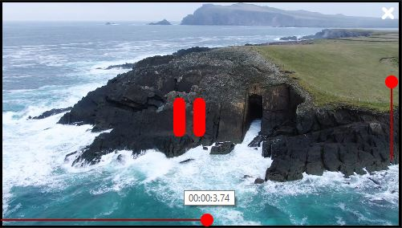
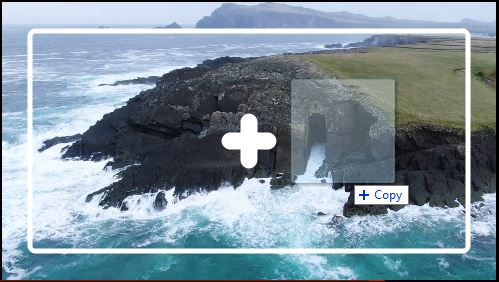

# <b>VLC Player</b>

 

## <b>About</b>

Minimalist Media Player based on Python, libVLC and PySide2.  
This project was created for fun only.

## <b>Requirements</b>
- Python 3.7+ (Tested on python 3.7 and 3.8)
- PySide2
- LibVLC (included is dll for win 64)
- Git

## <b>Keyboard Shortcut</b>
<table>
    <tr>
        <th>Key</th>
        <th>Function</th>
    </tr>
    <tr>
        <td>Left (←), A, Less (<), Comma(,)</td>
        <td>Go to the previous frame</td>
    </tr>
    <tr>
        <td>Right(→), D, Greater(>), Period(.)</td>
        <td>Go to the previous frame</td>
    </tr>
    <tr>
        <td>Up(↑), Plus(+)</td>
        <td>Increase volume by 5</td>
    </tr>
    <tr>
        <td>Down(↓), Minus(-)</td>
        <td>Decrease volume by 5</td>
    </tr>
    <tr>
        <td>Space</td>
        <td>Toggle Play/Pause</td>
    </tr>
    <tr>
        <td>Enter/Return(⮨), O</td>
        <td>Open File Dialog</td>
    </tr>
    <tr>
        <td>F11, F</td>
        <td>Toggle Fullscreen</td>
    </tr>
    <tr>
        <td>Tab, L</td>
        <td>open Playlist (Not working yet)</td>
    </tr>
    <tr>
        <td>Slash(/), Question Mark(?)</td>
        <td>Open Help (Not working yet)</td>
    </tr>
    <tr>
        <td>Escape</td>
        <td>Exit Player</td>
    </tr>
</table>

## <b>Todo</b>
Future :
- Youtube annotation (maybe)
- Playlist (maybe)
- Better button icon for anti aliasing
- Pin on top

On Hold :
- Show buffer progress (not supported by libvlc https://forum.videolan.org/viewtopic.php?t=145746)
- Enable seek after video is finished (Solution not found yet)
- Overlay 2 video (Multiple instance supported but seems like no transparency option)
- Luminance Compare

## <b>Changelog:</b>
2 May 2021
- Add Pin Button, Repeat Button, Add Button, Playlist Button, Volume Button 
- Youtube support using pafy

1 May 2021
- Update using libvlc4
- Using libvlc callback instead of QTimer
- Separate MediaContainer class to another file
- Animate visibility on hover or leave
- Open file dialog
- Right Click Menu
- Middle Click Seek
- Add keyboard short cut
- Show frame on tooltip
- Auto reset media on play end

30 April 2021
- Setup buttons and slider and stylesheet
- Toggle Button Visibility on hover
- Show current time on slider
- Keep Ratio on resize
- Drag and drop file
- Double Click Fullscreen
- Volume Control
- Timeslider seek to change video current time
- Hide cursor after idle for 5 second
- Play/Pause on click

29 April 2021
- Initial Setup

## <b>License</b>

Released under the GNU General Public License (GPL, or “free software”).

## Credits
- Icon Pack by <a href="https://www.flaticon.com/packs/music-player-icons?k=1619703368307" style="color: White;">Chanut</a>
- Sample Video by <a href="https://www.pexels.com/video/waves-crashing-on-rocks-2155942/" style="color: White;">Miles</a>